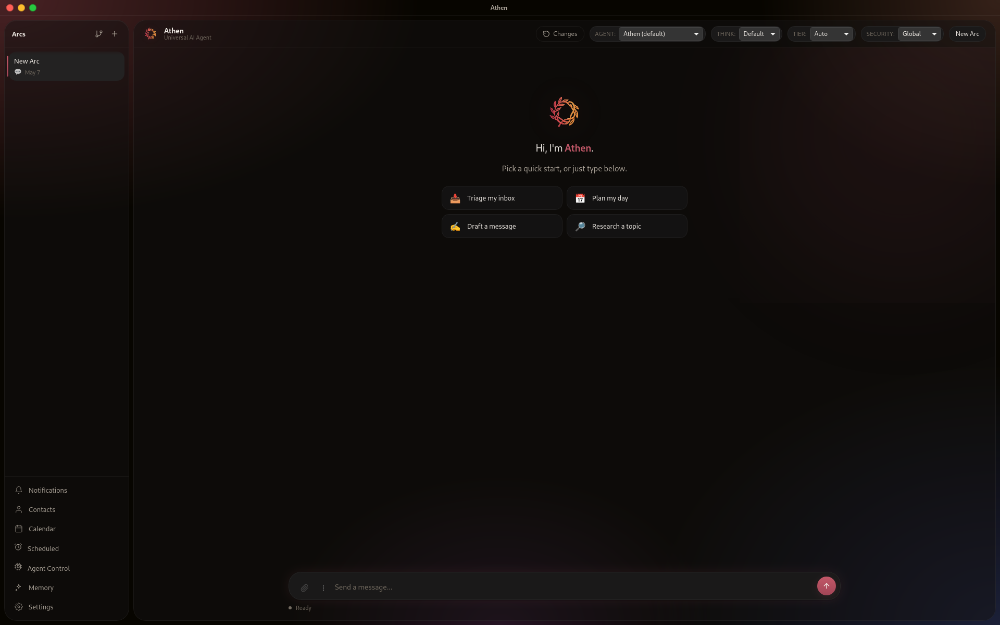

# Athen

> **An open, native AI agent that runs on your laptop, not someone's server.**

[](https://github.com/albiol2004/Athen/actions/workflows/ci.yml)
[](https://github.com/albiol2004/Athen/releases/latest)
[](LICENSE)
[](https://www.rust-lang.org)
[](https://tauri.app)

> 🚀 **Athen is live on Product Hunt today.** If you've used it and have
> opinions — kind or otherwise — that's the place to drop them. Every
> upvote and comment is read by the human who built this.

Athen watches your inbox, calendar, and messages, decides what needs doing,
and does it — autonomously, with a risk system that knows when to act
silently and when to ask first.



It's designed to be **easy for everyday people, powerful for power users**:
a single native binary you double-click, with a tray icon and a clean
window — but underneath, a hexagonal Rust core, a real risk model, MCP
support, and a tool surface you can extend.

> ⚠️ **Status: alpha (v0.3.3) — early but moving fast.** Core agent loop,
> tools, risk system, senses, MCP runtime, and infrastructure are working
> and well-tested. The surface is small on purpose and the UI is being
> polished release by release. Pre-built binaries are **unsigned** today —
> see [Install](#install) for the one-line workaround on each OS.
>
> 🙏 **Feedback shapes the roadmap.** Athen ships with a small,
> deliberately focused feature set. **What gets built next is driven by
> the people using it.** Open an issue, leave a comment on a discussion,
> or just tell me what's missing — every signal counts at this stage.
>
> 👤 **Athen is a one-person project.** I'm building it solo, in the open,
> because I wanted this tool to exist and nothing on the market fit. That
> means rough edges, but it also means **your feedback lands on a real
> human's desk and genuinely steers what comes next** — no committee, no
> backlog graveyard. Bug reports, feature requests, design critiques,
> "this confused me" notes — all welcome and all read.

---

## Why Athen exists

Today's AI assistants come in two flavours, and neither fits an everyday
person who just wants help with their life:

- **Developer-first agents** (Claude Code, Cursor, Aider) — incredible, but
  they live in a terminal and assume you know what an LLM is.
- **Cloud SaaS agents** — convenient until you realize your inbox,
  calendar, and contacts are being mailed to a third party for
  processing, you're paying per seat, and the agent stops working the
  day the company pivots.

Athen sits in the middle: a **native desktop app** that runs on
**your machine**, with **your keys** (or no keys at all), agnostic about
which LLM you point it at, MIT-licensed, no telemetry, no lock-in.
It's also **designed to run continuously** — it sits in the tray and keeps
sensing, even when the window is closed. Same binary will eventually run
headless on a server.

### Why Rust + Tauri (and not Electron)

Because we don't want to ship a 200 MB browser per app. Athen is **a
single native binary, ~30 MB**, that idles in the tray with negligible
CPU and a few dozen MB of RAM. WebKitGTK (Linux), WebView2 (Windows), or
WKWebView (macOS) — whatever the OS already has — renders the UI. No
Chromium fork, no Node runtime, no React-on-Windows quirks.

---

## What it does, today

| Capability | Status |
|---|---|
| **Core agent loop** — LLM tool calling, streaming, cancellation, completion judge | ✅ |
| **Shell + filesystem tools** — `shell_execute/spawn/kill/logs`, `read/edit/write/grep`, sandboxed via bwrap/Landlock/sandbox-exec/Job Objects | ✅ |
| **Persistent semantic memory** — vector index + knowledge graph in SQLite, multiple embedding backends | ✅ |
| **Web search & fetch** — DuckDuckGo (no key), Tavily (optional), Jina Reader → Wayback fallback chain | ✅ |
| **Calendar & contacts** — local SQLite, CalDAV sync (iCloud, Google, Fastmail, Nextcloud, etc.), trust-level model for unknown senders | ✅ |
| **MCP runtime** — spawn and route any Model Context Protocol server (stdio JSON-RPC) | ✅ |
| **Senses** — Email (IMAP), Calendar, Telegram, generic User input | ✅ |
| **Risk system** — regex rules + LLM fallback, base-impact × trust-multiplier scoring | ✅ |
| **Security modes** — per-arc Bunker / Assistant / Yolo posture, enforced at every approval gate | ✅ |
| **Sandbox** — OS-native (bwrap/Landlock/sandbox-exec/Job Objects) + Podman/Docker tier | ✅ |
| **LLM provider routing** — failover, circuit breakers, budget tracker | ✅ |
| **Auto-update** — minisign-signed in-app updates from GitHub Releases | ✅ |
| **Onboarding wizard** — first-launch provider/key setup (local vs. cloud, memory backend) | ✅ |
| **Vision (image + PDF input)** — native multimodal via Anthropic & Gemini providers | ✅ |
| **Reasoning / thinking mode** — Claude extended thinking, DeepSeek-R1, Gemini thinkingConfig surfaced as `reasoning_content` | ✅ |
| **Wake-ups / proactive scheduling** — one-shot + recurring agent-triggered or user-scheduled actions, with autonomy-band controls | ✅ |
| **Generic HTTP tool + 15 cloud API presets** — Jina, Firecrawl, Brave, SerpAPI, DeepL, ElevenLabs, OpenRouter, Groq, ... | ✅ |
| **Encrypted credential vault** — OS keychain backend + ChaCha20-Poly1305 file fallback | ✅ |
| **Voice phone calls** — agent-placed outbound calls (`place_call`) via Twilio + Pipecat, STT/TTS, multi-turn, live transcript | ✅ |
| **Delegation / sub-agents** — `spawn_subagent` runs a scoped task on its own arc with inherited model pin + budget | ✅ |
| **Headless server mode** — daemon binary for always-on hosts | ❌ planned |

---

## Install

> **Pre-built binaries are unsigned today.** Each OS will warn you the
> first time you launch. Below is the one-line workaround per platform —
> code-signing certificates are next on the post-launch list.

Grab the latest release from
**[github.com/albiol2004/Athen/releases](https://github.com/albiol2004/Athen/releases/latest)**.

### Linux

Pick the channel that matches your distro. The first three are kept up to
date automatically — `pacman -Syu`, `dnf upgrade`, `apt upgrade` will pull
new Athen versions like any other system package.

- **Arch / CachyOS / EndeavourOS / Manjaro (AUR):**
  ```bash
  yay -S athen-bin   # or paru, pikaur — any AUR helper
  ```
- **Fedora / RHEL / Alma / Rocky (COPR):**
  ```bash
  sudo dnf copr enable albiol2004/athen
  sudo dnf install athen
  ```
- **Debian / Ubuntu (one-off `.deb`):** `sudo apt install ./athen_*_amd64.deb`
- **Anything else (AppImage):** `chmod +x Athen_*.AppImage && ./Athen_*.AppImage`

> ⚠️ The AppImage bundles WebKitGTK and its Wayland/EGL stack. On some
> hosts (notably Fedora 44+ with Mesa 26+) the bundled libs collide with
> the system Mesa and the WebKit renderer aborts with `EGL_BAD_PARAMETER`.
> If you hit this, install through your package manager (AUR / COPR / .deb)
> instead. Tracking issue:
> [#1](https://github.com/albiol2004/Athen/issues) (please file one if
> you see it).

### macOS (Apple Silicon)
- Download `Athen_<version>_aarch64.dmg`.
- macOS builds are **Apple Silicon only** today. Intel Mac builds will return once code signing is in place.
- After dragging into Applications, the first launch will say *"Athen is damaged and can't be opened"*. **It isn't.** Run once:
  ```bash
  xattr -d com.apple.quarantine /Applications/Athen.app
  ```
  then open normally.

### Windows
- Download `Athen_<version>_x64-setup.exe`.
- SmartScreen will say *"Windows protected your PC"*. Click **More info → Run anyway**.

After the first launch, Athen checks for updates every few hours.
**AppImage, macOS, and Windows installs self-update in-app** via a
minisign-signed manifest. **System-package installs (AUR, COPR, .deb)
are managed by their respective package managers** — Athen will tell you
when a new version is out and link to the release notes; the actual
upgrade goes through `pacman` / `dnf` / `apt`.

### Build from source

```bash
git clone https://github.com/albiol2004/Athen.git && cd Athen
cargo run -p athen-app --release
```

System dependencies for Linux: see [the workflow](.github/workflows/release.yml#L55).

---

## Bring your own LLM (or run local)

Athen routes by **profile** (Powerful / Fast / Code / Cheap) so you can put
a frontier model on hard work and a tiny local model on the easy stuff.

| Provider | Mode | Notes |
|---|---|---|
| **Anthropic** | Cloud | Claude Opus / Sonnet / Haiku, native vision + PDF input |
| **Google (Gemini)** | Cloud | Gemini 2.5 / 3 Pro / Flash / Flash-Lite, native vision + PDF, generous free tier |
| **DeepSeek** | Cloud | Cheap and capable, R1 reasoning surfaced as `reasoning_content` |
| **OpenAI-compatible** | Cloud or local | Works with OpenAI, Mistral, Together, Groq, OpenRouter, ... |
| **Ollama** | **Local** | Talks to `localhost:11434` |
| **llama.cpp** | **Local** | Talks to `localhost:8080`. Pair with a Qwen / Llama / Mistral GGUF |

The local-only path means **zero data leaves your machine.** No API key,
no third party, no telemetry.

---

## Tools the agent has

A built-in tool surface that covers shell, files, memory, web, calendar,
contacts, email, scheduling, and arbitrary HTTP — plus anything you expose
through MCP.

- **Shell & files:** `shell_execute`, `shell_spawn` / `kill` / `logs`, `read`, `edit`, `write`, `delete_file` (checkpoint-snapshotted, revertable), `grep`, `list_directory`
- **Memory:** `memory_store`, `memory_recall` (semantic, persistent; dedup at recall + store)
- **Identity:** `identity_add` — agent can write to your personality / rules / knowledge / team store
- **Web:** `web_search`, `web_fetch` (static → Jina Reader → Wayback fallback chain)
- **Calendar:** `calendar_list` / `create` / `update` / `delete` (updates push to CalDAV remotes)
- **Contacts:** `contacts_list` / `search` / `create` / `update` / `delete`
- **Email:** `send_email` (auto-approves when recipient is the owner; risk-gated otherwise)
- **Cloud APIs:** `http_request` against any endpoint you register — 15 presets out of the box (Jina, Firecrawl, Brave, SerpAPI, Hunter, Apollo, PDL, DeepL, NewsAPI, Open-Meteo, Frankfurter, OpenCage, ElevenLabs, OpenRouter, Groq); vault-backed credentials, per-endpoint rate limiting
- **Wake-ups:** `create_wakeup` — agent can schedule one-shot or recurring proactive triggers (reminders, follow-ups, digests), each with its own autonomy band and tool allowlist
- **Telegram:** `send_telegram` — agent-initiated outbound messages to your Telegram chat
- **Voice:** `place_call` — place an outbound phone call (Twilio + Pipecat); agent converses in a chosen language toward an objective and returns a transcript. Always confirmation-gated
- **Delegation:** `spawn_subagent` (formerly `delegate_to_agent`, alias kept) — spawn a sub-agent on its own arc with a scoped task, budget, and tool allowlist; inherits the parent's model pin and reasoning effort, deliverable verified before returning
- **Skills:** `load_skill` — load a user-authored playbook (SKILL.md folder) on demand; listed in the static prefix at startup
- **Self-support:** `athen_docs` — agent reads Athen's own built-in setup / config / troubleshooting guides
- **MCP:** any tool from any spawned MCP server, namespaced `<mcp_id>__<tool>`

Full reference in [`docs/TOOLS_AND_SENSES.md`](docs/TOOLS_AND_SENSES.md).

---

## Extensibility (for power users)

Athen is built so you don't have to fork it to make it do new things.

- **Custom MCP servers** — point Athen at any binary speaking the
  [Model Context Protocol](https://modelcontextprotocol.io) over stdio.
  Tools appear automatically; the same risk system gates them.
- **Custom LLM providers** — `athen-llm` exposes the `LlmProvider` trait.
  Implement once, register in the router, swap by profile. Local
  llama.cpp wrapper is ~150 lines.
- **Custom senses** — implement `SenseMonitor` in `athen-sentidos`. The
  monitor runs in its own process and feeds normalized `SenseEvent`s back
  over IPC. Good for hooking up an RSS feed, a webhook, a webcam, etc.
- **Headless mode** — `cargo run -p athen-cli --release` gives you a REPL
  against the same agent core. A proper `athend` daemon for always-on
  server hosting is planned for a future release.

---

## Privacy & safety

- **No telemetry.** Period. No analytics SDK, no crash reporter, no
  beacon — anywhere.
- **All data stays local.** Calendar, contacts, memory, conversation
  history all live in SQLite under `~/.athen/`. Sync is opt-in and not
  shipped yet.
- **Risk system before action.** Every tool call carries a base impact
  (Read / WritePersist) multiplied by contact trust. High-risk actions
  prompt you or require pre-grant.
- **Security modes you control.** A per-arc **Bunker / Assistant / Yolo**
  posture sits on top of the risk system: Bunker escalates borderline
  actions to a confirmation, Assistant is the balanced default, Yolo lets
  everything short of a hard block run unattended. Set it from the chat
  header; an agent can never loosen its own posture.
- **Sandboxed shell.** `shell_execute` is gated by a regex+LLM rule
  engine, then runs in a writable-only-where-allowed sandbox.
- **Bring your own keys, or none at all.** The local Ollama/llama.cpp
  path is a plain HTTP call to `localhost`; nothing leaves the box.

Full threat model: [`docs/ARCHITECTURE.md`](docs/ARCHITECTURE.md).

---

## Architecture in 30 seconds

```
SENTIDOS (sense monitors) ──IPC──► SENSE ROUTER ──► COORDINADOR
                                                         │
                                              risk eval, queue, dispatch
                                                         │
                                                  Agent workers
                                                         │
                                  ┌──────────────────────┴────────────┐
                                  ▼                                   ▼
                              Tool execution                      LLM router
                       (shell, files, web, MCP, ...)        (failover + budget)
```

- **Hexagonal:** `athen-core` defines all traits. Every other crate is a
  swappable adapter. No crate depends on a sibling.
- **Multi-process:** sense monitors run as their own processes, talk over
  Unix sockets / Named pipes. One bad monitor can't take the agent down.
- **Independently testable:** mock the trait, not the service.

```
crates/
  athen-core/         # Traits + types — the contracts
  athen-ipc/          # IPC transport
  athen-sentidos/     # Sense monitors
  athen-coordinador/  # Router, risk, queue, dispatch
  athen-agent/        # Agent worker (LLM executor + tools + auditor)
  athen-llm/          # LLM provider adapters + router
  athen-web/          # Web search / page reader providers
  athen-mcp/          # MCP runtime catalog
  athen-memory/       # Vector index + knowledge graph
  athen-risk/         # Risk scoring
  athen-persistence/  # SQLite, checkpoints, arcs, calendar, contacts
  athen-contacts/     # Trust model
  athen-sandbox/      # OS-native + container sandboxing
  athen-shell/        # Nushell + native shell
  athen-cli/          # CLI / REPL
  athen-app/          # Tauri 2 desktop app — the composition root
```

For a deeper read see [`docs/ARCHITECTURE.md`](docs/ARCHITECTURE.md).

---

## Roadmap

**Shipped since v0.2.x:**
- ✅ Voice phone calls (`place_call` — Twilio + Pipecat, multi-turn, live transcript)
- ✅ Per-arc security modes (Bunker / Assistant / Yolo)
- ✅ Provider Bundles + per-arc provider pinning, reasoning-effort control
- ✅ Hybrid memory (semantic + lexical + graph), sub-agent delegation deep-pass

**v0.3.x (current — ongoing polish):**
- Code signing (macOS notarization, Windows Trusted Signing)
- Screenshot tool + screen-capture sense
- Prompt-cache wiring across providers (Anthropic `cache_control`, Gemini implicit cache, DeepSeek cost UI)

**Next:**
- `athend` headless server mode (systemd unit, Docker image)
- More senses (Slack, Discord, RSS, generic webhook)

**Bigger picture:**
- Plugin marketplace beyond MCP
- Federated multi-device sync (CRDT, end-to-end encrypted)
- Mobile companion

---

## Contributing & feedback

This is a **very early release** of a **one-person project** with a
deliberately narrow feature set. The single most useful thing you can do
right now is **tell me what's missing or what's broken** — open an
[issue](https://github.com/albiol2004/Athen/issues) or start a
[discussion](https://github.com/albiol2004/Athen/discussions). Every
report is read by the same person who wrote the code; roadmap priorities
are reweighted every cycle based on what real users ask for. If something
feels off — say so. I genuinely appreciate it.

PRs welcome too. House rules:
- `cargo clippy --workspace -- -D warnings` must be clean
- `cargo test --workspace` must pass
- `athen-core` does not depend on its siblings
- Each crate stays independently testable

Read the architecture before sending non-trivial PRs:
[`docs/ARCHITECTURE.md`](docs/ARCHITECTURE.md) →
[`docs/IMPLEMENTATION.md`](docs/IMPLEMENTATION.md) →
[`docs/CONFIGURATION.md`](docs/CONFIGURATION.md) →
[`docs/TOOLS_AND_SENSES.md`](docs/TOOLS_AND_SENSES.md).

Security issues: see [`SECURITY.md`](SECURITY.md). Please don't open public issues for vulnerabilities.

---

## License

[MIT](LICENSE). Use it however you like.

---

## Acknowledgements

- [**Tauri**](https://tauri.app) — native desktop in Rust without the Electron tax
- [**Tokio / Reqwest / Serde / Tracing**](https://tokio.rs) — the Rust async backbone
- [**SQLite**](https://sqlite.org) — the unsung hero of every desktop app
- [**Model Context Protocol**](https://modelcontextprotocol.io) — the right standard at the right time
- [**Claude Code**](https://claude.com/claude-code) — proof that great agent harnesses are possible

Built by [Alejandro Garcia](https://alejandrogarcia.blog).
